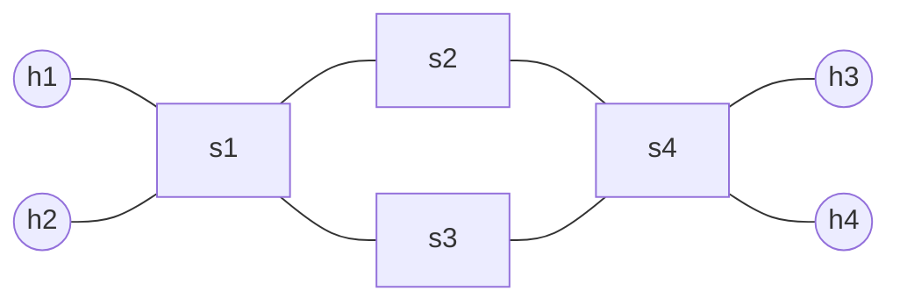
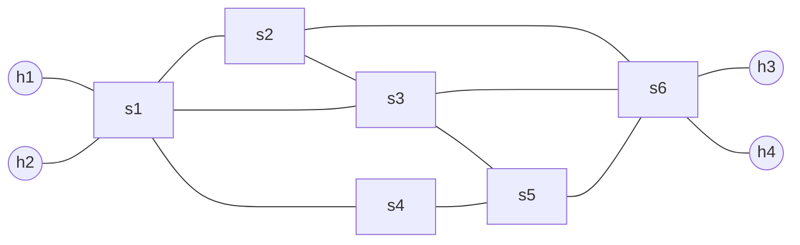

# Diagram Topologi Eksperimen (Diamond dan Partial Mesh)

Dokumen ini disiapkan agar sesuai kebutuhan proposal: minimal dua topologi dengan jalur alternatif untuk komparasi single-path vs multipath.

## 1) Topologi Diamond (Baseline)

Karakteristik:
- 4 switch, 4 host.
- Memiliki 2 jalur alternatif equal-cost antara switch sumber dan tujuan.
- Cocok sebagai baseline untuk melihat perbedaan single-path dan multipath.



Rute alternatif utama (s1 ke s4):
- Jalur A: s1 -> s2 -> s4
- Jalur B: s1 -> s3 -> s4

Skrip Mininet:
- [SPF/topo-diamond_lab.py](../topo-diamond_lab.py)

## 2) Topologi Partial Mesh (Kompleks)

Karakteristik:
- 6 switch, 4 host.
- Memiliki lebih dari 2 jalur alternatif antara switch edge.
- Mewakili kondisi jaringan yang lebih realistis untuk evaluasi distribusi flow.



Rute alternatif utama (s1 ke s6):
- Jalur 1: s1 -> s2 -> s6
- Jalur 2: s1 -> s3 -> s6
- Jalur 3: s1 -> s4 -> s5 -> s6

Skrip Mininet:
- [SPF/topo-partial_mesh_lab.py](../topo-partial_mesh_lab.py)

## Cara Menjalankan

```bash
# Diamond
cd /workspaces/learn_sdn/SPF
sudo python3 topo-diamond_lab.py

# Partial Mesh
cd /workspaces/learn_sdn/SPF
sudo python3 topo-partial_mesh_lab.py
```

## Kesesuaian dengan Proposal

- Syarat minimal 2 topologi terpenuhi: Diamond + Partial Mesh.
- Diamond dipakai sebagai baseline 2 jalur alternatif setara.
- Partial Mesh dipakai untuk skenario lebih kompleks dengan >2 jalur alternatif.
- Keduanya siap dipakai untuk komparasi:
  - Single-path: Dijkstra, Bellman-Ford.
  - Multipath SPF: distribusi flow/hash atau ECMP.
